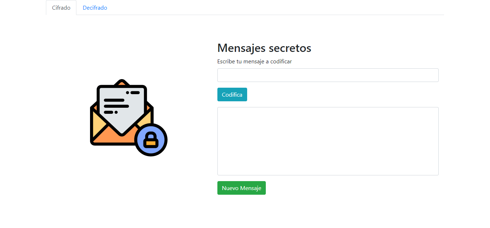
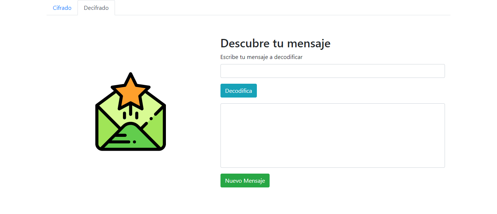
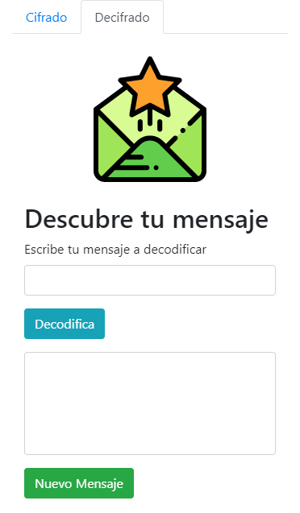

## Cifrado y Descifrado Cesar ES6

La siguiente web ha sido diseñada para cifrar y descifrar palabras según el algoritmo del cifrado de Cesar con Javascript ES6.
Más información sobre el cifrado de Cesar en el siguiente link: [Caesar_cipher](https://en.wikipedia.org/wiki/Caesar_cipher)

### Especificaciones de la página web
* La web esta conformada por una página principal  `index.html` con dos pestañas:
  * Pestaña 1 : Cifrado
  * Pestaña 2 : Decifrado
* Se trabajo con Bootstrap 4, la cual se ubica dentro de la carpeta `vendors`.
* Se implemento Jquery para las funcionalidades de Bootstrap.

### Especificaciones de la función Cipher y Decipher

Para la función **cipher** se implemento lo siguiente :

*  Validar que no se ingrese números ni que el campo este vacio.

*  Implementar un for que recorra la cadena , letra por letra para ir cambiandola según la fórmula del cifrado de Cesar.

### Versión desktop

### Versión Mobile

Realizado por Carla Centeno Ramos 